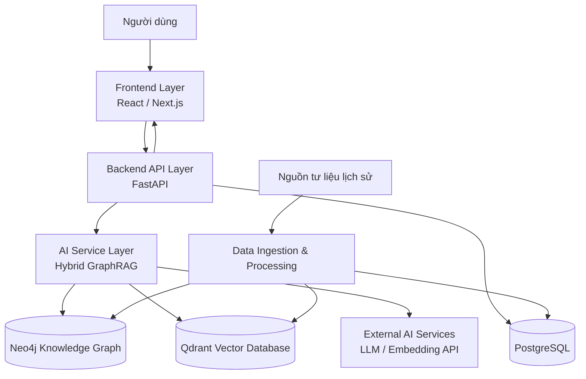
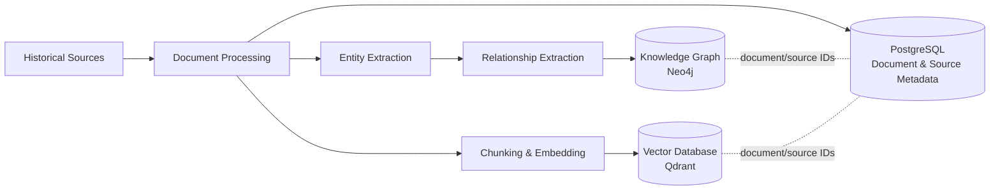
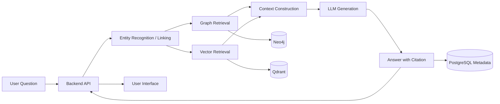

# Kiến trúc hệ thống

## 1. Mục tiêu kiến trúc

**Vietnam Modern History Knowledge Graph Explorer** là nền tảng khám phá tri thức lịch sử Việt Nam hiện đại giai đoạn 1945–1975. Kiến trúc được thiết kế để kết hợp dữ liệu lịch sử có xuất xứ rõ ràng, Knowledge Graph, truy xuất ngữ nghĩa và Large Language Model (LLM) thành câu trả lời có ngữ cảnh và citation.

Nguyên tắc trung tâm là Hybrid GraphRAG: LLM chỉ tạo câu trả lời từ ngữ cảnh được truy xuất từ đồ thị tri thức, tài liệu nguồn và vector database. Hệ thống không được thiết kế như một chatbot chỉ dựa vào kiến thức pretrained của mô hình.

## 2. Tổng quan kiến trúc

### 2.1 Frontend Layer

**Vai trò.** Frontend là lớp tương tác trực tiếp với người dùng: khám phá Knowledge Graph, tra cứu thực thể/sự kiện, xem timeline, đặt câu hỏi cho AI Historical Assistant và xem citation.

**Trách nhiệm chính.**

- Hiển thị giao diện web, biểu mẫu tìm kiếm và màn hình hỏi đáp.
- Trực quan hóa node và relationship của Knowledge Graph.
- Hiển thị kết quả truy vấn, câu trả lời AI, tài liệu nguồn và metadata citation.
- Gửi yêu cầu người dùng đến Backend API và hiển thị phản hồi mà không trực tiếp kết nối đến cơ sở dữ liệu hoặc LLM.

**Tương tác.** Frontend gọi Backend API qua HTTP/JSON. Backend trả dữ liệu đồ thị, dữ liệu tài liệu, kết quả tìm kiếm hoặc câu trả lời đã kèm citation để frontend trình bày.

### 2.2 Backend API Layer

**Vai trò.** Backend API là điểm vào duy nhất cho các chức năng của ứng dụng, điều phối các yêu cầu từ frontend tới dữ liệu và AI service.

**Trách nhiệm chính.**

- Cung cấp API cho tìm kiếm, khám phá đồ thị, timeline và hỏi đáp.
- Quản lý người dùng, vai trò và xác thực JWT theo phạm vi đã nêu trong PCD.
- Kiểm tra dữ liệu đầu vào, chuẩn hóa request/response và áp dụng quy tắc truy cập.
- Truy vấn PostgreSQL cho dữ liệu quan hệ và gọi AI Service Layer cho các tác vụ Hybrid GraphRAG.
- Đóng gói citation cùng câu trả lời trước khi trả cho frontend.

**Tương tác.** Nhận request từ frontend; đọc/ghi metadata nghiệp vụ trong PostgreSQL; gọi AI Service để nhận context và câu trả lời; trả response có cấu trúc cho frontend. Backend không thay thế các chức năng suy luận, truy xuất graph hoặc sinh embedding của AI Service Layer.

### 2.3 AI Service Layer

**Vai trò.** AI Service Layer hiện thực Hybrid GraphRAG cho hai nhóm tác vụ: trích xuất tri thức khi nạp dữ liệu và trả lời câu hỏi dựa trên dữ liệu đã truy xuất.

**Trách nhiệm chính.**

- Hiểu câu hỏi, nhận diện và liên kết thực thể lịch sử.
- Truy xuất node/relationship có liên quan từ Neo4j, bao gồm các đường liên kết cần cho reasoning nhiều bước.
- Truy xuất các đoạn tài liệu tương đồng ngữ nghĩa từ Qdrant.
- Kết hợp graph facts, đoạn văn và metadata nguồn thành context có cấu trúc.
- Gọi LLM để trích xuất entity/relationship hoặc sinh câu trả lời theo context.
- Duy trì ánh xạ từ evidence về document/source để trả citation có thể kiểm chứng.

**Tương tác.** Nhận yêu cầu được Backend API điều phối; đọc graph từ Neo4j và vector từ Qdrant; dùng External AI Services cho LLM/embedding; trả về câu trả lời cùng evidence và citation cho Backend. Trong ingestion, lớp này cung cấp kết quả trích xuất để ghi vào Neo4j, Qdrant và metadata liên quan.

### 2.4 Data Layer

**Vai trò.** Data Layer lưu trữ bền vững dữ liệu lịch sử, metadata và các biểu diễn phục vụ truy xuất Hybrid GraphRAG.

**Trách nhiệm chính.**

- **PostgreSQL:** quản lý người dùng, role, nguồn tư liệu, document và metadata quan hệ.
- **Neo4j:** lưu ontology lịch sử gồm Person, Event, Organization, Location, Document và các relationship giữa chúng.
- **Qdrant:** lưu embedding của các đoạn tài liệu và payload định danh document/source để tìm kiếm ngữ nghĩa và truy vết citation.

**Tương tác.** Backend truy cập PostgreSQL cho dữ liệu ứng dụng. AI Service truy vấn Neo4j và Qdrant để tạo context. Pipeline ingestion đồng bộ document và metadata nguồn sang các kho lưu trữ phù hợp; định danh document/source được giữ xuyên suốt để liên kết evidence với citation.

### 2.5 External AI Services

**Vai trò.** Các dịch vụ AI bên ngoài cung cấp mô hình ngôn ngữ lớn và embedding model; PCD cho phép sử dụng OpenAI API, Gemini API hoặc Claude API.

**Trách nhiệm chính.**

- Sinh embedding cho tài liệu/đoạn văn và truy vấn.
- Hỗ trợ trích xuất entity và relationship từ tài liệu lịch sử.
- Sinh câu trả lời dựa trên context Hybrid GraphRAG và prompt theo chế độ giải thích của người dùng.

**Tương tác.** Chỉ AI Service Layer gọi các API này. Kết quả LLM được ràng buộc bởi context đã truy xuất; citation do hệ thống tạo từ metadata evidence, không suy diễn từ văn bản sinh tự do của LLM.

# Lựa chọn công nghệ

## Frontend

| Công nghệ | Mục đích sử dụng | Lợi ích đối với dự án | Phù hợp với Knowledge Graph + AI |
| --- | --- | --- | --- |
| React / Next.js | Xây dựng giao diện web và các trang khám phá tri thức. | Thành phần UI tái sử dụng, tổ chức ứng dụng rõ ràng và phù hợp cho web application hoàn chỉnh. | Hỗ trợ các màn hình tìm kiếm, hỏi đáp, timeline và graph explorer trong cùng một ứng dụng. |
| TypeScript | Định nghĩa kiểu dữ liệu cho API request/response, node, edge và citation. | Giảm lỗi tích hợp frontend–backend, tăng khả năng bảo trì. | Các cấu trúc graph và kết quả AI có nhiều trường metadata; typing giúp hiển thị nhất quán. |
| TailwindCSS | Tạo kiểu giao diện và layout. | Phát triển UI nhanh, nhất quán và dễ điều chỉnh. | Phù hợp để xây dựng giao diện trực quan cho graph, timeline, kết quả trả lời và nguồn tham khảo. |
| Cytoscape.js | Trực quan hóa và tương tác với mạng node–edge. | Có khả năng render graph, chọn node, mở rộng quan hệ và áp dụng style. | Trực tiếp đáp ứng chức năng Knowledge Graph Explorer của PCD. |

## Backend

| Công nghệ | Mục đích sử dụng | Lợi ích đối với dự án | Phù hợp với Knowledge Graph + AI |
| --- | --- | --- | --- |
| FastAPI | Xây dựng REST API giữa frontend, dữ liệu và AI services. | Hiệu năng tốt, hỗ trợ async và tự sinh tài liệu API. | Phù hợp với các request truy xuất graph/vector và gọi LLM có độ trễ I/O. |
| Python | Ngôn ngữ triển khai backend, pipeline dữ liệu và AI. | Hệ sinh thái mạnh cho xử lý văn bản, data engineering và AI. | Dễ tích hợp Neo4j, Qdrant, LangChain và LLM APIs trong một luồng Hybrid GraphRAG. |
| SQLAlchemy | ORM và lớp truy cập PostgreSQL. | Mô hình hóa dữ liệu quan hệ rõ ràng, quản lý query và transaction tốt hơn. | Phù hợp để quản lý user, role, document, source và metadata phục vụ citation. |

## Database

| Công nghệ | Mục đích sử dụng | Lợi ích đối với dự án | Phù hợp với Knowledge Graph + AI |
| --- | --- | --- | --- |
| PostgreSQL | Lưu dữ liệu quan hệ và metadata nghiệp vụ. | Ràng buộc dữ liệu, transaction và quan hệ khóa ngoại đáng tin cậy. | Lưu provenance của document/source và dữ liệu người dùng tách biệt với đồ thị tri thức. |
| Neo4j | Lưu và truy vấn Knowledge Graph. | Truy vấn relationship và đường đi nhiều bước tự nhiên bằng Cypher. | Phục vụ entity exploration, causal/temporal relation và Graph Retrieval. |
| Qdrant | Lưu vector embedding của các đoạn tài liệu. | Tìm kiếm tương đồng ngữ nghĩa hiệu quả, kèm payload metadata. | Bổ sung Vector Retrieval cho graph facts để tạo Hybrid GraphRAG có ngữ cảnh tài liệu. |

## AI

| Công nghệ | Mục đích sử dụng | Lợi ích đối với dự án | Phù hợp với Knowledge Graph + AI |
| --- | --- | --- | --- |
| LangChain | Điều phối prompt, retriever và lời gọi mô hình. | Chuẩn hóa pipeline AI, giảm mã tích hợp lặp lại. | Hỗ trợ kết hợp graph retrieval, vector retrieval và LLM trong một workflow GraphRAG. |
| LLM API | Hiểu câu hỏi, trích xuất tri thức và sinh câu trả lời. | Khai thác năng lực ngôn ngữ mà không cần fine-tuning trong phạm vi PCD. | LLM nhận context có cấu trúc từ graph và tài liệu để trả lời có căn cứ. |
| Embedding model | Chuyển đoạn tài liệu và truy vấn thành vector. | Cho phép semantic search ngoài khả năng khớp từ khóa. | Tìm evidence liên quan ngay cả khi cách diễn đạt câu hỏi khác tài liệu nguồn. |

# Luồng dữ liệu

## 1. Pipeline thu thập và xử lý dữ liệu

1. **Historical Sources:** Thu thập tư liệu từ các nguồn lịch sử có xuất xứ rõ ràng theo chiến lược nguồn của PCD; mỗi nguồn cần metadata để truy vết.
2. **Document Processing:** Làm sạch, parse nội dung và trích xuất metadata. Hệ thống tạo bản ghi `sources` và `documents` trong PostgreSQL, chuẩn hóa nội dung để xử lý tiếp.
3. **Entity Extraction:** AI hỗ trợ xác định các thực thể Person, Event, Organization, Location và Document; thực thể được chuẩn hóa trước khi ghi đồ thị.
4. **Relationship Extraction:** AI hỗ trợ nhận diện quan hệ giữa các thực thể, sau đó biểu diễn thành relationship theo ontology đã quy định.
5. **Knowledge Graph:** Node và relationship được lưu trong Neo4j để hỗ trợ khám phá và truy vấn graph/multi-hop.
6. **Vector Database:** Nội dung document đã xử lý được chia thành các đoạn phù hợp, chuyển thành embedding và lưu tại Qdrant. Payload phải giữ `document_id` và `source_id` để liên kết kết quả vector với nguồn gốc.

## 2. Pipeline trả lời câu hỏi người dùng

1. **User Question:** Người dùng gửi câu hỏi lịch sử từ giao diện, có thể kèm chế độ giải thích Student, General hoặc Research.
2. **Backend API:** Backend xác thực/kiểm tra request, chuyển câu hỏi và tùy chọn trình bày cho AI Service Layer.
3. **Entity Recognition:** Hệ thống nhận diện thực thể lịch sử trong câu hỏi và liên kết chúng với node tương ứng, tránh truy vấn graph bằng tên tự do khi đã có định danh chuẩn.
4. **Graph Retrieval:** Từ thực thể đã liên kết, hệ thống truy vấn Neo4j để lấy node, relationship và các đường liên hệ có liên quan đến câu hỏi, ví dụ quan hệ nguyên nhân–kết quả hoặc trước–sau.
5. **Vector Retrieval:** Câu hỏi được embedding rồi tìm các đoạn tư liệu gần nhất trong Qdrant. Kết quả mang theo định danh document/source để có thể dẫn nguồn.
6. **Context Construction:** AI Service hợp nhất graph facts với đoạn văn truy xuất; lọc trùng lặp, giữ metadata chứng cứ và xây dựng prompt. Context được tách rõ phần facts, excerpts và citation candidates.
7. **LLM Generation:** LLM sinh câu trả lời theo context và phong cách yêu cầu. Lớp ứng dụng yêu cầu mô hình không bổ sung khẳng định không có evidence trong context.
8. **Answer with Citation:** Hệ thống ánh xạ các evidence đã dùng về document và source trong PostgreSQL, trả câu trả lời cùng citation/metadata để người dùng kiểm chứng.

