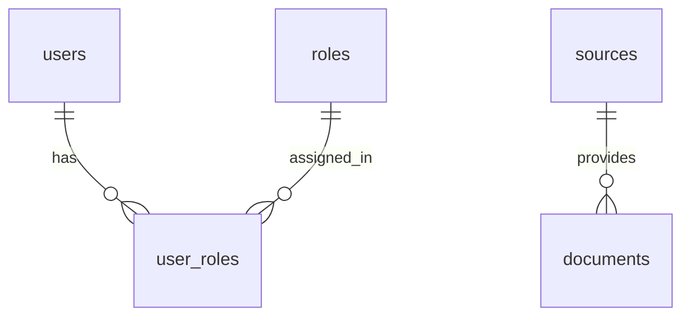

# Thiết kế cơ sở dữ liệu

## 1. Nguyên tắc thiết kế

Vietnam Modern History Knowledge Graph Explorer sử dụng mô hình lưu trữ đa cơ sở dữ liệu để phù hợp với dữ liệu lịch sử có cấu trúc và truy xuất Hybrid GraphRAG:

- **PostgreSQL** quản lý tài khoản, phân quyền, document, source và metadata có ràng buộc quan hệ.
- **Neo4j** biểu diễn thực thể lịch sử cùng các mối quan hệ để khám phá và reasoning theo graph.
- **Qdrant** (được mô tả trong kiến trúc hệ thống) lưu embedding của nội dung tài liệu; mỗi vector cần payload liên kết tới `documents.id` và `sources.id` để tạo citation.

Các định danh tài liệu/nguồn là liên kết provenance giữa các kho dữ liệu. Neo4j `Document.document_id` và payload Qdrant dùng giá trị `documents.id` của PostgreSQL.

# PostgreSQL Design

## 2. Quan hệ dữ liệu



## 3. Bảng `users`

**Purpose:** Lưu tài khoản người dùng của ứng dụng để xác thực và áp dụng quyền truy cập.

| Column | Data type | Null | Key / Constraint | Mô tả |
| --- | --- | --- | --- | --- |
| id | `UUID` | No | Primary Key | Định danh duy nhất của người dùng. |
| email | `VARCHAR(255)` | No | Unique | Địa chỉ email đăng nhập. |
| password_hash | `VARCHAR(255)` | No |  | Mật khẩu đã băm; không lưu mật khẩu dạng rõ. |
| full_name | `VARCHAR(255)` | Yes |  | Tên hiển thị của người dùng. |
| is_active | `BOOLEAN` | No | Default `TRUE` | Trạng thái hoạt động của tài khoản. |
| created_at | `TIMESTAMPTZ` | No | Default `CURRENT_TIMESTAMP` | Thời điểm tạo tài khoản. |
| updated_at | `TIMESTAMPTZ` | No |  | Thời điểm cập nhật gần nhất. |

- **Primary Key:** `id`.
- **Foreign Keys:** Không có.
- **Relationships:** Một user có thể được gán nhiều role qua bảng `user_roles`.

## 4. Bảng `roles`

**Purpose:** Lưu danh mục vai trò truy cập để phân quyền cho người dùng.

| Column | Data type | Null | Key / Constraint | Mô tả |
| --- | --- | --- | --- | --- |
| id | `UUID` | No | Primary Key | Định danh duy nhất của role. |
| name | `VARCHAR(100)` | No | Unique | Tên role. |
| description | `TEXT` | Yes |  | Mô tả phạm vi role. |
| created_at | `TIMESTAMPTZ` | No | Default `CURRENT_TIMESTAMP` | Thời điểm tạo role. |

- **Primary Key:** `id`.
- **Foreign Keys:** Không có.
- **Relationships:** Một role có thể được gán cho nhiều user qua bảng `user_roles`.

## 5. Bảng `user_roles`

**Purpose:** Bảng liên kết many-to-many giữa `users` và `roles`.

| Column | Data type | Null | Key / Constraint | Mô tả |
| --- | --- | --- | --- | --- |
| user_id | `UUID` | No | Primary Key, Foreign Key | Tham chiếu `users.id`. |
| role_id | `UUID` | No | Primary Key, Foreign Key | Tham chiếu `roles.id`. |
| assigned_at | `TIMESTAMPTZ` | No | Default `CURRENT_TIMESTAMP` | Thời điểm gán role. |

- **Primary Key:** Khóa chính tổng hợp (`user_id`, `role_id`) để không gán trùng một role cho cùng user.
- **Foreign Keys:** `user_id → users.id`; `role_id → roles.id`.
- **Relationships:** Thực hiện quan hệ many-to-many giữa user và role.

## 6. Bảng `sources`

**Purpose:** Lưu thông tin nguồn gốc của tư liệu lịch sử, là cơ sở provenance và citation.

| Column | Data type | Null | Key / Constraint | Mô tả |
| --- | --- | --- | --- | --- |
| id | `UUID` | No | Primary Key | Định danh duy nhất của nguồn. |
| title | `VARCHAR(500)` | No |  | Tên nguồn hoặc kho lưu trữ. |
| source_type | `VARCHAR(100)` | No |  | Loại nguồn, ví dụ archive, library, historical document hoặc website. |
| publisher | `VARCHAR(255)` | Yes |  | Cơ quan/tổ chức phát hành hoặc lưu trữ. |
| source_url | `TEXT` | Yes |  | Đường dẫn gốc để kiểm chứng khi có. |
| publication_date | `DATE` | Yes |  | Ngày xuất bản của nguồn, nếu xác định được. |
| accessed_at | `TIMESTAMPTZ` | Yes |  | Thời điểm hệ thống truy cập nguồn trực tuyến. |
| citation_text | `TEXT` | Yes |  | Thông tin citation chuẩn hóa để hiển thị. |
| created_at | `TIMESTAMPTZ` | No | Default `CURRENT_TIMESTAMP` | Thời điểm tạo bản ghi. |
| updated_at | `TIMESTAMPTZ` | No |  | Thời điểm cập nhật gần nhất. |

- **Primary Key:** `id`.
- **Foreign Keys:** Không có.
- **Relationships:** Một source có thể cung cấp nhiều document; một document thuộc một source trong thiết kế prototype này.

## 7. Bảng `documents`

**Purpose:** Lưu document lịch sử đã được thu thập/xử lý cùng metadata để truy xuất, đồng bộ sang Knowledge Graph và vector database.

| Column | Data type | Null | Key / Constraint | Mô tả |
| --- | --- | --- | --- | --- |
| id | `UUID` | No | Primary Key | Định danh document dùng xuyên suốt giữa các kho dữ liệu. |
| source_id | `UUID` | No | Foreign Key | Nguồn cung cấp document, tham chiếu `sources.id`. |
| title | `VARCHAR(500)` | No |  | Tiêu đề document. |
| document_type | `VARCHAR(100)` | No |  | Loại document, ví dụ hiệp định, văn kiện hoặc báo cáo. |
| original_url | `TEXT` | Yes |  | Đường dẫn tới tài liệu gốc. |
| language | `VARCHAR(20)` | Yes |  | Ngôn ngữ của tài liệu. |
| published_date | `DATE` | Yes |  | Ngày phát hành/tạo tài liệu nếu xác định được. |
| content | `TEXT` | Yes |  | Nội dung văn bản đã parse/chuẩn hóa phục vụ xử lý. |
| processing_status | `VARCHAR(50)` | No |  | Trạng thái xử lý, ví dụ pending, processed hoặc failed. |
| created_at | `TIMESTAMPTZ` | No | Default `CURRENT_TIMESTAMP` | Thời điểm tạo bản ghi. |
| updated_at | `TIMESTAMPTZ` | No |  | Thời điểm cập nhật gần nhất. |

- **Primary Key:** `id`.
- **Foreign Keys:** `source_id → sources.id`.
- **Relationships:** Nhiều document thuộc một source. Mỗi document có thể được biểu diễn bằng một node `Document` trong Neo4j và nhiều vector chunk trong Qdrant qua `document_id`.

# Neo4j Knowledge Graph Design

## 8. Quy ước ontology

Neo4j lưu tri thức lịch sử đã được chuẩn hóa, không thay thế kho document gốc. Mỗi node `Document` giữ `document_id` để liên kết với PostgreSQL. Các thuộc tính `source_id` trên node và relationship (khi có) cho phép truy vết evidence về nguồn.

## 9. Nodes

| Node label | Mục đích | Important Properties |
| --- | --- | --- |
| `Person` | Biểu diễn nhân vật lịch sử. | `id`, `name`, `aliases`, `description`, `birth_date`, `death_date`, `source_id` |
| `Event` | Biểu diễn sự kiện lịch sử trong phạm vi 1945–1975. | `id`, `name`, `description`, `start_date`, `end_date`, `source_id` |
| `Organization` | Biểu diễn chính phủ, phong trào, tổ chức hoặc cơ quan liên quan. | `id`, `name`, `aliases`, `description`, `source_id` |
| `Location` | Biểu diễn địa điểm có liên quan đến sự kiện và thực thể lịch sử. | `id`, `name`, `description`, `latitude`, `longitude`, `source_id` |
| `Document` | Biểu diễn tài liệu là evidence trong graph. | `id`, `document_id`, `title`, `document_type`, `published_date`, `source_id` |

`id` là định danh ổn định trong Neo4j; `document_id` trên label `Document` tham chiếu đến `documents.id` ở PostgreSQL. Các thuộc tính ngày cho event hỗ trợ Timeline Explorer.

## 10. Relationships

| Relationship | Ý nghĩa | Source Node | Target Node |
| --- | --- | --- | --- |
| `PARTICIPATED_IN` | Nhân vật hoặc tổ chức tham gia một sự kiện. | `Person` hoặc `Organization` | `Event` |
| `COMMANDS` | Nhân vật hoặc tổ chức chỉ huy một sự kiện. | `Person` hoặc `Organization` | `Event` |
| `LOCATED_AT` | Một sự kiện xảy ra tại địa điểm. | `Event` | `Location` |
| `CAUSED` | Một sự kiện là nguyên nhân hoặc tác động dẫn tới sự kiện khác. | `Event` | `Event` |
| `FOLLOWED_BY` | Một sự kiện diễn ra sau một sự kiện khác theo dòng thời gian. | `Event` | `Event` |
| `DESCRIBES` | Một document mô tả một thực thể hoặc sự kiện. | `Document` | `Person`, `Event`, `Organization` hoặc `Location` |

Các relationship có thể mang properties `source_id`, `document_id`, `evidence_text` và `confidence` khi cần ghi nhận nguồn chứng cứ, đoạn chứng cứ và độ tin cậy của kết quả trích xuất.

## 11. Ví dụ Cypher schema

```cypher
// Ràng buộc định danh duy nhất cho ontology.
CREATE CONSTRAINT person_id_unique IF NOT EXISTS
FOR (n:Person) REQUIRE n.id IS UNIQUE;

CREATE CONSTRAINT event_id_unique IF NOT EXISTS
FOR (n:Event) REQUIRE n.id IS UNIQUE;

CREATE CONSTRAINT organization_id_unique IF NOT EXISTS
FOR (n:Organization) REQUIRE n.id IS UNIQUE;

CREATE CONSTRAINT location_id_unique IF NOT EXISTS
FOR (n:Location) REQUIRE n.id IS UNIQUE;

CREATE CONSTRAINT document_id_unique IF NOT EXISTS
FOR (n:Document) REQUIRE n.id IS UNIQUE;

// Tạo các node minh họa.
MERGE (event:Event {
  id: 'event-dien-bien-phu',
  name: 'Chiến dịch Điện Biên Phủ',
  start_date: date('1954-03-13'),
  end_date: date('1954-05-07')
})
MERGE (person:Person {id: 'person-vo-nguyen-giap', name: 'Võ Nguyên Giáp'})
MERGE (location:Location {id: 'location-dien-bien-phu', name: 'Điện Biên Phủ'})
MERGE (document:Document {
  id: 'graph-document-example',
  document_id: 'postgresql-document-uuid',
  title: 'Tư liệu về Chiến dịch Điện Biên Phủ'
})
MERGE (person)-[:COMMANDS {
  evidence_text: 'Thông tin chỉ huy được trích từ tài liệu nguồn.',
  confidence: 0.95
}]->(event)
MERGE (event)-[:LOCATED_AT]->(location)
MERGE (document)-[:DESCRIBES]->(event);
```

Ví dụ trên chỉ minh họa schema và cách lưu provenance; dữ liệu thực tế phải được tạo từ pipeline xử lý tài liệu và được đối chiếu với nguồn lịch sử đã thu thập.
